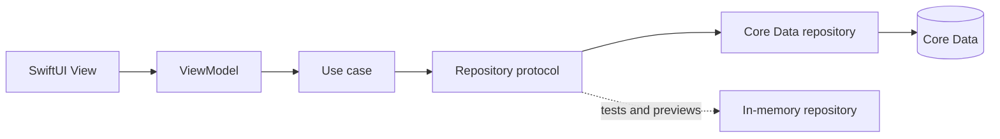

# RoutineReady

RoutineReady is an iPhone app for property managers in NSW. It helps you book routine inspections that actually follow the law, get through the day's inspections, and keep defect photos attached to the right property instead of lost in the camera roll.

This was made for UTS Assessment Task 3 (Platform-Integrated Solution).

## Project overview

The app is set up around how a property manager's day goes. You check today's run sheet in the morning, drive between properties, walk through each one logging anything that needs fixing, and then sort out the photos afterwards.

There are six screens:

- **Today's Run Sheet** is the home tab. It lists today's inspections in time order.
- **Portfolio** lists every property and you can search by address or suburb. You can also add a new property from here.
- **Property Detail** shows the tenant, landlord, past inspections and how many of the 4 yearly inspections have been used (e.g. "2 of 4 routine inspections used in the last 12 months").
- **Schedule Inspection** is where you book. If the booking breaks one of the NSW rules, it tells you why and what to do instead.
- **Inspection in Progress** is used on site. You log maintenance items (room, description, severity and a photo if you want), write a condition summary and then complete the inspection.
- **Shared Photos Inbox** shows any photos from the share extension that couldn't be filed automatically so you can move them to another inspection.

There's also a widget and a share extension, explained further down.

## Domain context

The stakeholder is a residential property manager at a Sydney agency who does their own routine inspections across about 100 to 150 rental properties.

The problem is that NSW law puts limits on routine inspections, and it's easy to get them wrong when you're booking a lot of them. On top of that, photos of defects taken during inspections end up mixed in with everything else in the camera roll.

The rules the app checks when booking come from the Residential Tenancies Act 2010 (NSW) s 55 and NSW Fair Trading's guidance on landlord access:

1. The tenant has to get at least 7 days written notice. The app counts this in calendar days using Sydney time.
2. A property can't have more than 4 routine inspections in any 12 month period. This is a rolling 12 months, not a calendar year, and cancelled inspections don't count. The app works this out from the database every time instead of storing a counter.
3. No inspections on Sundays or NSW public holidays.
4. The inspection has to start between 8am and 8pm (so 7:59pm is the latest start).
5. If the tenant agrees in writing, rules 1, 3 and 4 don't apply, but the 4 per year limit still does. The app saves the fact that the tenant agreed on the inspection.

When something breaks a rule, the message says what's wrong and what to do next, e.g. "This tenant needs 7 days written notice. The earliest lawful date is Wed 14 Oct."

## Architecture

The app is split into layers, and each one only talks to the one below it:



A few things about how it fits together:

- Views and ViewModels never import Core Data. Each ViewModel gets the use cases it needs passed into its init, and all of that gets set up in one place, `App/AppDependencies.swift`.
- Each use case is a small struct named after what it does (`ScheduleRoutineInspection`, `CompleteRoutineInspection`, `LogMaintenanceItem`, `ImportSharedPhotos` and so on) with one `execute` method and its own error enum.
- The models (`Property`, `RoutineInspection`, `MaintenanceItem`) are normal Swift structs. Only the repositories know about Core Data objects.
- The current date comes from a `DateProviding` protocol so the tests can pretend it's a certain day. All the date logic uses Sydney time.
- Public holidays are behind a protocol too (`NSWPublicHolidays`). The real version has the 2026 and 2027 holidays typed in.

Folder layout:

```
RoutineReady/
  App/            app entry point, tabs, AppDependencies, demo data
  Domain/         the models and the NSW rule constants
  UseCases/       one file per use case
  Repositories/   repository protocols + in-memory versions
  Persistence/    Core Data model, entity classes and repositories
  Platform/       widget snapshot writer, shared inbox reader, public holidays
  Features/       the six screens (a View and ViewModel each)
Shared/           code used by the app, widget and share extension
RoutineReadyWidget/
RoutineReadyShare/
RoutineReadyTests/
```

## Extensions and why

**Widget ("Next inspection").** Between inspections the property manager is driving, so they need to see the next address quickly without opening the app. The small widget shows the next time and address, the medium one also shows how many urgent maintenance items need landlord approval, and the Lock Screen version is one line like "11:15 · 14 Rose St, Yagoona". When there's nothing left for the day it says "No more inspections today".

The widget doesn't read the database. After every change the app saves a small `widget-snapshot.json` file into the App Group and tells WidgetKit to reload. The widget also refreshes itself when the next inspection starts so it moves on to the one after.

**Share extension ("Add to inspection").** After walking through a property, the photos are in the camera roll. From the Photos app you can select up to 10 photos, tap Add to inspection, then pick the inspection and room and add a note if you want. The extension saves the photos and a small record for each one into the App Group. It doesn't touch the database either. Next time RoutineReady is opened, it turns each photo into a maintenance item. If the inspection was cancelled in the meantime, the photo goes to the Shared Photos Inbox instead so you can move it.

## Database choice

I used Core Data, saved in the app's own container (not the App Group).

- It's private and works offline. Tenant details stay on the phone, and it still works in places with bad reception like basements and car parks.
- The data is relational (property, then inspections, then maintenance items) and deleting a property deletes its inspections and items. The important checks are done as Core Data predicates:
  - Run sheet: `status == "scheduled" AND scheduledAt >= startOfToday AND scheduledAt < startOfTomorrow`
  - Annual limit: `property.id == %@ AND status != "cancelled" AND scheduledAt >= %@ AND scheduledAt <= %@`
  - Urgent items: `severity == "urgent" AND isResolved == NO`
- CloudKit would let the data sync between devices, but it needs an iCloud account, makes some relationships optional, and would mean storing tenant details in iCloud. For one property manager on one phone, plain Core Data made more sense.

Photos are saved as image files in the App Group and Core Data only stores the file name.

## App Group

The App Group identifier is:

```
group.com.lucas.routineready
```

It's turned on for all three targets (the app, the widget and the share extension). This is what's stored in it:

- `widget-snapshot.json`: the app writes it, the widget reads it
- `share-inspections.json`: the app writes it, the share extension reads it (it's the list of inspections you can pick from)
- `Photos/`: the defect photos
- `Inbox/`: one file per photo shared from the share extension, waiting for the app to file it

## Setup

You'll need Xcode 26.5 or newer. The deployment target is iOS 26.5, so use an iOS 26.5 simulator.

1. Open `RoutineReady.xcodeproj`.
2. For each of the three targets, go to Signing & Capabilities, choose your Team, and make sure the App Group `group.com.lucas.routineready` is ticked.
3. Pick the RoutineReady scheme and an iPhone simulator and press ⌘R.

The first time it runs, it adds some demo properties (in Yagoona, Bankstown, Bass Hill and Punchbowl) with four inspections booked for that day. The demo inspections are for the day you install the app, so if you come back the next day, delete the app and run it again to get a fresh day.

**Running the tests**

Either press ⌘U in Xcode, or run:

```
xcodebuild test -scheme RoutineReady -destination 'platform=iOS Simulator,name=iPhone 17' -only-testing:RoutineReadyTests
```

**Adding the widget to the Home Screen**

Go to the Home Screen (⇧⌘H), long-press on an empty spot, tap Edit then Add Widget, search for RoutineReady and add the small and medium sizes.

**Adding the widget to the Lock Screen**

Lock the simulator (⌘L) and click to wake it, then long-press the Lock Screen, tap Customize, choose Lock Screen, tap the area under the clock and add RoutineReady.

**Testing the share sheet**

Drag any image from Finder onto the simulator window and it gets added to Photos. Open the photo in Photos, tap Share, then Add to inspection (if you can't see it, scroll to More and turn it on). Pick an inspection and a room and tap Save. When you open RoutineReady again, the photo shows up as a maintenance item on that inspection.

## Testing

The unit tests are in `RoutineReadyTests` and use XCTest. They run against the in-memory repositories with a fake clock (set to Wednesday 7 October 2026, 9am Sydney time), a fake holiday list and a spy for the widget, so they never touch Core Data.

What they cover:

- Booking with 7 days notice works, 6 days doesn't (and the error suggests the right date), and exactly 7 days is allowed
- The suggested date skips Sundays and public holidays
- Sundays and public holidays are rejected
- 7:59pm is allowed but 8pm isn't
- Times that have already passed are rejected
- A 5th inspection in 12 months is rejected, the limit is a rolling 12 months and not a calendar year, and cancelled inspections aren't counted
- If the tenant agrees, short notice is fine but the 4 per year limit still applies
- Completing needs a condition summary, and cancelled or future inspections can't be completed
- Urgent maintenance items need a room, but routine ones don't
- Shared photos get turned into maintenance items, photos for a cancelled inspection stay in the inbox, and they can be moved to another inspection
- Booking refreshes the widget, and a failed booking doesn't
- The "used in the last 12 months" count is correct, and the real holiday list has Labour Day 2026

## Attribution

Apple documentation I used:

- Core Data (`NSPersistentContainer`, `NSFetchRequest`, `NSPredicate`)
- WidgetKit (`TimelineProvider`, creating a widget extension, Lock Screen widget families)
- App extensions (share extensions, `NSExtensionActivationRule`, `NSExtensionContext`)
- App Groups (`containerURL(forSecurityApplicationGroupIdentifier:)`)
- PhotosUI (`PhotosPicker`)
- SwiftUI and Observation (`@Observable`)
- XCTest

Other sources:

- NSW public holiday dates are from the NSW Government Industrial Relations website (2026 and 2027).
- The inspection rules are from the Residential Tenancies Act 2010 (NSW) s 55 and NSW Fair Trading.

AI assistance: the code for this project was written with Claude Code (by Anthropic), based on my spec and design decisions. I checked and tested it in the simulator at each stage.

## Known limitations

- The public holidays are only typed in for 2026 and 2027, so they'll need updating for 2028. Bank Holiday isn't included because it only applies to banks.
- The 4 per year limit only looks back 12 months from the date being booked. It doesn't check whether inspections already booked later on would go over 4 in some other 12 month window.
- The widget can only be as up to date as the last time the app saved. Just after midnight it can show "No more inspections today" until the app is opened.
- The share extension only lists today's scheduled inspections, and the list is from the last time the app was opened.
- There's no syncing between devices and the app doesn't create notice of entry letters.
- The demo data only gets added when the app has no data, and it's tied to the day the app was installed.
