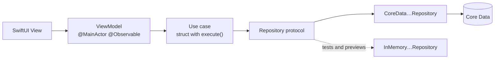

# RoutineReady

An iOS app that helps a Sydney property manager book lawful routine inspections, run the day's inspections, and file defect photos against the right property.

Built for UTS Assessment Task 3 (Platform-Integrated Solution).

## Project overview

RoutineReady follows the property manager's day:

| Screen | What it is for |
|---|---|
| **Today's Run Sheet** (home tab) | Today's scheduled routine inspections in time order |
| **Portfolio** (tab) | Every property, searchable by address or suburb; add a property |
| **Property Detail** | Tenant, landlord, inspection history and "2 of 4 routine inspections used in the last 12 months" |
| **Schedule Inspection** | Date, time and notice date, with the NSW rules checked and explained inline |
| **Inspection in Progress** | Log maintenance items (room, description, severity, photo), write the condition summary, complete |
| **Shared Photos Inbox** (tab) | Photos from the share extension that could not be filed, ready to reassign |

Two extensions bring the app onto the rest of the phone:

- **Next inspection widget** (Home Screen small and medium, Lock Screen rectangular)
- **Add to inspection share extension** (share photos straight from the Photos app)

## Domain context

**Stakeholder:** a residential property manager at a Sydney agency who personally runs routine inspections across about 100–150 rental properties.

**Problem:** NSW law limits routine ("general") inspections, and defect photos taken on site get lost in the camera roll.

The app enforces these rules when booking (Residential Tenancies Act 2010 (NSW) s 55; NSW Fair Trading, *Landlord access to the property*):

1. At least **7 days written notice** between the notice being served and the inspection (calendar days in Sydney time).
2. **No more than 4 non-cancelled routine inspections in any rolling 12 months** for a property. This is counted fresh from the database on every booking, not stored as a counter.
3. **Not on a Sunday or NSW public holiday.**
4. **Starting between 8:00 am and 7:59 pm.**
5. If the **tenant agrees in writing**, rules 1, 3 and 4 are waived, but rule 2 still applies. The agreement is saved on the inspection.

Every error says what went wrong in the manager's own terms and what to do next, for example:
*"This tenant needs 7 days written notice. The earliest lawful date is Wed 14 Oct."*

## Architecture



- **Views and ViewModels never import Core Data.** ViewModels receive their use cases through `init`. They are built in `App/AppDependencies.swift`, the composition root.
- **Use cases** are small structs named after business operations (`ScheduleRoutineInspection`, `CompleteRoutineInspection`, `LogMaintenanceItem`, `ImportSharedPhotos`, …). Each throws its own error enum that conforms to `LocalizedError`.
- **Domain models** (`Property`, `RoutineInspection`, `MaintenanceItem`) are plain structs. They are mapped to and from Core Data only inside the repositories.
- **"Now" is injected** (`DateProviding`), so tests decide what today is. All date rules use a Sydney calendar.
- **NSW public holidays** sit behind the `NSWPublicHolidays` protocol, with the 2026–2027 holidays hardcoded in `GazettedNSWPublicHolidays`.

```
RoutineReady/
  App/            RoutineReadyApp, RootTabView, AppDependencies (composition root), DemoDataSeeder
  Domain/         Property, RoutineInspection, MaintenanceItem, RoutineInspectionRules, Sydney time
  UseCases/       one file per business operation, each with its error enum
  Repositories/   protocols + InMemory/ implementations
  Persistence/    RoutineReady.xcdatamodeld, PersistenceController, entities, CoreData repositories
  Platform/       WidgetSnapshotWriter, SharedInboxReader, NSWPublicHolidays
  Features/       RunSheet, Portfolio, PropertyDetail, ScheduleInspection, InspectionInProgress, SharedPhotosInbox
Shared/           AppGroup, WidgetSnapshot, SharedInboxRecord (app + widget + share extension)
RoutineReadyWidget/   Next inspection widget
RoutineReadyShare/    Add to inspection share extension
RoutineReadyTests/    unit tests
```

## Extensions and why

**Widget: driving between stops.** Between inspections the manager is in the car and needs one glance at the next address, without unlocking the phone and opening the app.
- Small: the next time and address.
- Medium: adds "N urgent items need landlord approval".
- Lock Screen: "11:15 · 14 Rose St, Yagoona".

When the day is done it says "No more inspections today". The widget reads only `widget-snapshot.json`, which the app rewrites after every change before calling `WidgetCenter.shared.reloadAllTimelines()`. Its timeline refreshes once the next inspection has started.

**Share extension: filing photos after the walk-through.** Photos taken in the Camera app end up in the camera roll, mixed in with everything else. From Photos, the manager selects up to 10 images, taps **Add to inspection**, and picks the inspection, room and an optional note.
- The extension saves the images to the App Group `Photos/` folder and one `SharedInboxRecord` JSON per photo to `Inbox/`. It never opens Core Data.
- When RoutineReady next becomes active, `ImportSharedPhotos` turns each record into a maintenance item.
- If the inspection has been cancelled in the meantime, the photo stays in the Shared Photos Inbox so it can be reassigned.

## Database choice

**Core Data**, stored in the app's own container:

- **Private and offline.** Tenant names and inspection reports stay on the device, and the app works in the car, in basements and in poor-coverage suburbs.
- **Relational queries.** Property → inspections → maintenance items, with cascade deletes. The key rules are predicates rather than loops over all data:
  - Run sheet: `status == "scheduled" AND scheduledAt >= startOfToday AND scheduledAt < startOfTomorrow`
  - Annual limit: `property.id == %@ AND status != "cancelled" AND scheduledAt >= %@ AND scheduledAt <= %@`
  - Urgent backlog: `severity == "urgent" AND isResolved == NO`
- **CloudKit trade-off.** `NSPersistentCloudKitContainer` would sync across the manager's devices, but it adds an iCloud account dependency, makes some relationships optional, and would put tenant data in iCloud. For a single manager on one phone, local Core Data is simpler and keeps personal data on the device.

Photos are stored as files in the App Group. Core Data stores only `photoFilename`.

## App Group

```
group.com.lucas.routineready
```

The App Group is enabled on all three targets (app, widget and share extension). It holds:
- `widget-snapshot.json`: written by the app, read by the widget.
- `share-inspections.json`: written by the app, read by the share extension.
- `Photos/`: defect photos, written by the app and the share extension.
- `Inbox/`: `SharedInboxRecord` files, written by the share extension, read and deleted by the app.

## Setup

1. **Xcode 26.5** or later; the deployment target is **iOS 26.5**.
2. Open `RoutineReady.xcodeproj`. For each of the three targets, open **Signing & Capabilities**, set your **Team**, and check that the App Group `group.com.lucas.routineready` is ticked.
3. Choose the **RoutineReady** scheme and an **iOS 26.5** iPhone simulator, then press **⌘R**. On first launch a demo portfolio is seeded in Yagoona, Bankstown, Bass Hill and Punchbowl, with four inspections today.
   - The demo inspections are created for the day the app is installed. To get a fresh day, delete the app and run it again.

**Run the tests:**

```
xcodebuild test -scheme RoutineReady -destination 'platform=iOS Simulator,name=iPhone 17' -only-testing:RoutineReadyTests
```

**Add the widget to the Home Screen:**
1. Press ⇧⌘H, long-press an empty area, then tap **Edit → Add Widget**.
2. Search for **RoutineReady** and add the small and medium sizes.

**Add the widget to the Lock Screen:**
1. Press ⌘L and click to wake the screen.
2. Long-press → **Customize → Lock Screen**, tap the area under the clock, and add **RoutineReady**.

**Test the share sheet from Photos:**
1. Drag an image from Finder onto the Simulator to add it to Photos.
2. In Photos, open the image and tap **Share → Add to inspection**. If it isn't in the row, use **More** to turn it on.
3. Pick an inspection and a room, then tap **Save**.
4. Open RoutineReady. The photo appears as a maintenance item on that inspection.

## Testing

The unit tests in `RoutineReadyTests` use XCTest against the in-memory repositories, a fixed clock (Wed 7 Oct 2026, 9:00 am Sydney), a stub holiday list and a spy widget writer. They never touch Core Data. They cover:

- **Booking:**
  - 7 days notice is accepted and 6 days is rejected, with the earliest lawful date suggested. Exactly 7 days is accepted, and the suggested date skips Sundays and holidays.
  - Sundays and public holidays are rejected.
  - A 7:59 pm start is allowed and 8:00 pm is rejected.
  - Times in the past are rejected.
  - The 5th inspection in the rolling 12 months is rejected, and the window is rolling, not a calendar year.
  - Cancelled inspections don't count toward the limit.
  - Tenant consent waives the notice, day and hour rules but not the annual limit.
- **Completing:** a condition summary is required; cancelled and not-yet-due inspections are rejected.
- **Maintenance:** an urgent item needs a room; routine items don't.
- **Shared photos:**
  - A shared photo is imported as a maintenance item.
  - A photo shared to a cancelled inspection stays in the inbox.
  - An unfiled photo can be reassigned to another inspection.
- **Widget:** a successful booking refreshes the widget snapshot; a rejected one doesn't.
- **Other:** the "used in the last 12 months" counter, and Labour Day 2026 in the real holiday list.

## Attribution

- Apple Developer Documentation:
  - Core Data (`NSPersistentContainer`, `NSFetchRequest`, `NSPredicate`)
  - WidgetKit (`TimelineProvider`, `Creating a widget extension`, `containerBackground`, accessory widget families)
  - App Extensions (Share extensions, `NSExtensionActivationRule`, `NSExtensionContext`)
  - App Groups (`containerURL(forSecurityApplicationGroupIdentifier:)`)
  - PhotosUI (`PhotosPicker`)
  - SwiftUI Observation (`@Observable`)
  - XCTest
- NSW public holiday dates: NSW Government, Industrial Relations, *Public holidays in NSW* (2026 and 2027).
- NSW inspection rules: Residential Tenancies Act 2010 (NSW) s 55; NSW Fair Trading.
- **AI assistance:** this code was written with **Claude Code** (Anthropic), working from my specification and design decisions. I reviewed and tested it in the Simulator at each checkpoint.

## Known limitations

- **Public holidays are hardcoded for 2026 and 2027 only.** The list needs extending before 2028, and the Bank Holiday is left out because it applies only to banks.
- **The annual limit looks back 12 months from the proposed date, as specified.** It doesn't check whether inspections already booked *after* that date would push a later 12-month window over 4.
- **The widget can only be as current as the app's last write.** The first time the widget refreshes after midnight, it reads yesterday's snapshot and shows "No more inspections today" until RoutineReady is opened.
- **The share extension offers today's scheduled inspections only.** Its list comes from `share-inspections.json`, so it reflects the app's state the last time the app was open.
- **There is no sync between devices** (see the CloudKit trade-off above), and no notice-of-entry letters are generated.
- **Demo data is seeded only into an empty store** and is tied to the install day.
